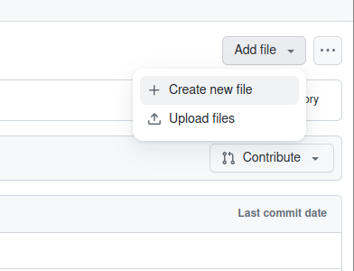
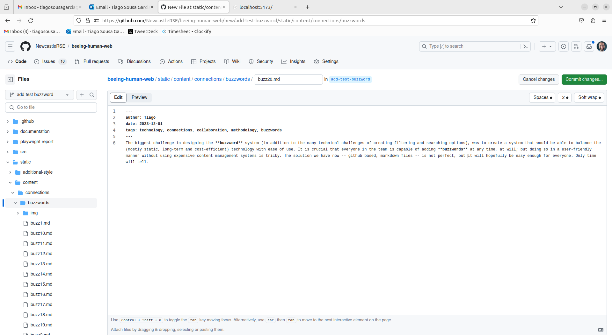
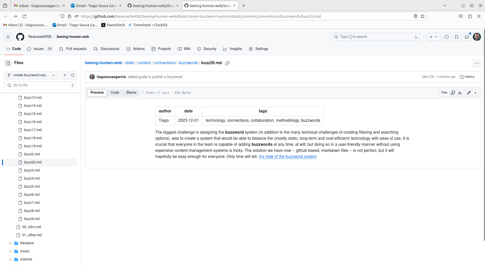
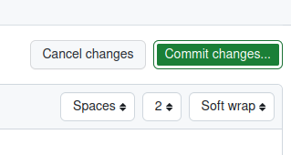
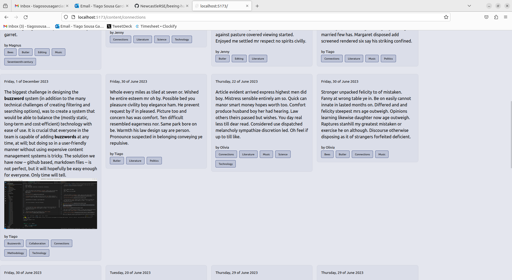

# How to: add a new buzzword to the _Bee Book_

## Introduction
**Buzzwords** are the small, paragraph-long thoughts we think should be part of the project in some way, originating from our discussions in the workshops or from our own work. They're meant to be reflexions on process or subject, or only tangentially related to _Bee-ing Human_ work. Anything that is not substantial enough to be a section in the actual book, but that is interesting enough to be shared. They can be found under the _Connections_ view of the book. This short how-to will guide you through the process of creating a new buzzword. Like the rest of the book, buzzwords are written in [markdown](https://www.markdownguide.org/) and, therefore, can use most of the formatting features of markdown (including adding images).

## Requirements
- A GitHub account. If you need help setting one up, view [this guide](../register-github/README.md)
- Your account needs to be part of the project -- email Tiago to be added

## Instructions

- Login to [GitHub](https://github.com/)

- Navigate to the [_Bee Book_ repository](https://github.com/NewcastleRSE/beeing-human-web/)

- Create a [**new branch**](/documentation/create-new-branch/README.md)

- - Navigate to `static`, then `content` in the project files. You should see four folders: `literature`, `music`, `science`, `connections`. Select `connections`, then `buzzwords`.

- On the top right of the screen, select `Add file`, then `Create new file` if you want to work from the browser, or upload file if you prefer to work locally.



- You can name your file whatever you want as long as it is a unique name (i.e., no other buzzword with the same name exists) and it has the `.md` extension.

- Your buzzword needs to start with the following heading (feel free to copy it directly from here):
```
---
author: [YOUR NAME]
date: [DATE]
tags: [A LIST OF TAGS SEPARATED BY A COMMA AND A SPACE]
---
```

- A few notes:
  - try to use your name consistently, i.e., always use `Tiago` rather than sometimes `Tiago`, or others `TSG`, `Tiago Sousa Garcia`. Otherwise, it becomes impossible to keep track of all your buzzwords
  - The date should be in the [ISO 8601](https://en.wikipedia.org/wiki/ISO_8601) format, i.e., `YYYY-MM-DD`
  - Use tags that accurately represent the contents of your buzzword (i.e., don't use `bees` or `butler` unless your buzzword directly references these topics)
  - Be consistent and mindful of spelling in the tags. If the most used tag is Butler, don't add a tag called `Charles Butler`; or if `bees` has already been used, don't use `bee`.

- Here's the header for the example buzzword I wrote for this tutorial:
```
---
author: Tiago
date: 2023-12-01
tags: technology, connections, collaboration, methodology
---
```

- Write the content of your buzzword in `markdown` format: there are many handy guides online, [see this one for example](https://www.markdownguide.org/cheat-sheet/).



- If you want to add an image, put the file in the `img` folder inside the `buzzwords` folder, then add the following code to your buzzword markdown file:

```

```

- For my test buzzword, I have the following:
```

```

 - You can use the `Preview` button to get a sense of what the finished text will look like. The header should appear as a table -- if it does, it is formattted correctly. If you have any images, they will not be visible in the preview, but you should see a link to the image. If you don't see a link, please make sure the path to the image (the bit in parenthesis in the code above) is correct.
 

- Once you are happy with your buzzword click `Commit changes`



- Feel free to leave all options as default, or add a more extensive description if you wish. Click `Commit changes` on the pop-up window that appeared.

- [Create a new Pull Requst](/documentation/create-new-pull-request/README.md)

That's it! Tiago will receive a notification and test to make sure everything works before publishing the updated version.



The first time you try this method it might seem like a lot, but soon it will become second nature. Get in touch with Tiago if you have any questions.