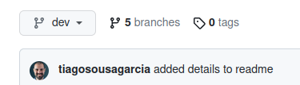
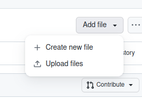
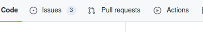
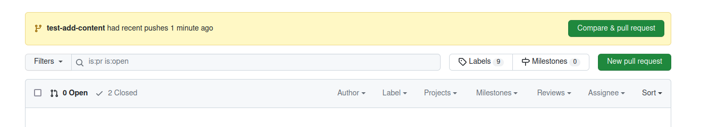
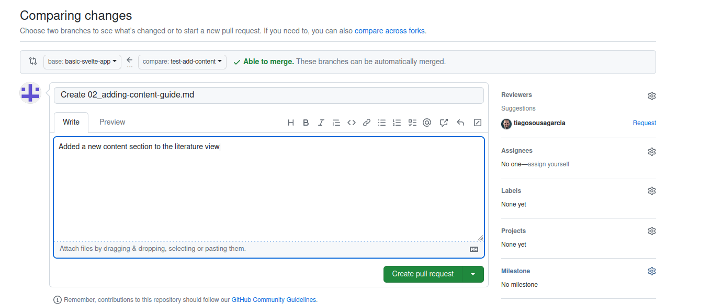
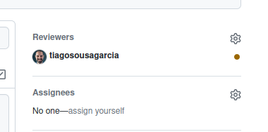

# How to: add a content section to the website

## Introduction

This short tutorial will guide you through the steps necessary to add new content to the _Bee book_. The steps to edit existing content are exactly the same, with the exception that instead of creating a new section file, you will edit an existing one.

## Requirements

- A GitHub account. If you need help setting one up, view [this guide](../register-github/README.md)
- Your account needs to be part of the project -- email Tiago to be added

## Instructions

- Login to [GitHub](https://github.com/)
- Navigate to the [_Bee Book_ repository](https://github.com/NewcastleRSE/beeing-human-web/)
- Create a **new branch**:

  - On the top left of the screen, below the repository's header, you should see a button with a down arrow like this:

  

  - Click on the button and type a new name in the box:

  

  - Press the return key (Enter) or select 'Create branch'

- Navigate to `static`, then `content` in the project files. You should see four folders: `literature`, `music`, `science`, `interdisciplinarity`. These folders correspond to each of the views on the website: adding content to one of these folders will create it in the corresponding view. Choose the folder corresponding to the view you want to add to or edit.
- Choose one `.md` file to edit, or create a new one:

  - On the top right of the screen, below the repository header, click the 'Add file' button

  

  - Click 'Create new file', or upload a new file if you prefer to work locally.
  - Give your new file an appropriate name -- descriptive, but with no spaces, and with the `.md` extension. The start of the file **must** include a two-digit number that corresponds to its position on the page. So if you want to include something following `00_introduction.md`, your new file should be `01_another-section.md`. The naming convention is: `XX_your-file-title.md`. If the section you want to include should appear between existing sections, you will need to alter the names and headers of all other files affected accordingly (i.e., if you want to create something to show on position 1, everything else needs to shift upwards by one).

  

  - The file **must** include the following header at the very top. You can copy-paste it directly from here if you wish:

  ```
  ---
  title: [ENTER TITLE HERE]
  type: md
  order: [SAME AS IN FILE NAME]
  ---
  ```

  - Write the content in `Markdown` format: there are many handy guides online, [see this one for example](https://www.markdownguide.org/cheat-sheet/).

  

  - You can use the `Preview` button to get a sense of what the finished text will look like. The header should appear as a table -- if it does, it is formattted correctly.

  

- Once you are happy with your new file, or the changes to the existing file, click `Commit changes`


- Feel free to leave all options as default, or add a more extensive description if you wish. Click `Commit changes` on the pop-up window that appeared.
- Navigate to the `Pull Requests` tab on the repository header



- You should see a yellow banner with the name of the branch you created and a `Compare & pull request` button



- Click on the `Compare & pull request` button
- Feel free to leave the title of the pull request as default, replace the pre-populated body of the text with something descriptive like: 'added a new content section to...'



- On the right-hand side panel, you will see a section entitle `Reviewers` -- Tiago's name should appear as one of the suggestions. Click the `Request` link next to his name. The link should be replaced by a little yellow dot.



- Click `Create pull request`

That's it! Tiago will receive a notification and test to make sure everything works before publishing the updated version.


The first time you try this method it might seem like a lot, but soon it will become second nature. Get in touch with Tiago if you have any questions.
