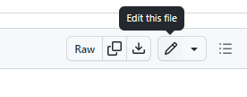
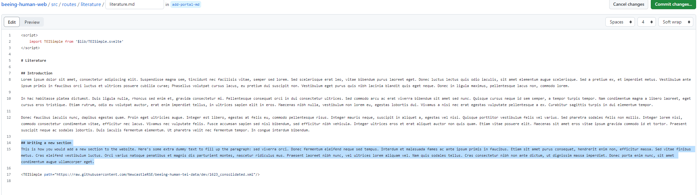
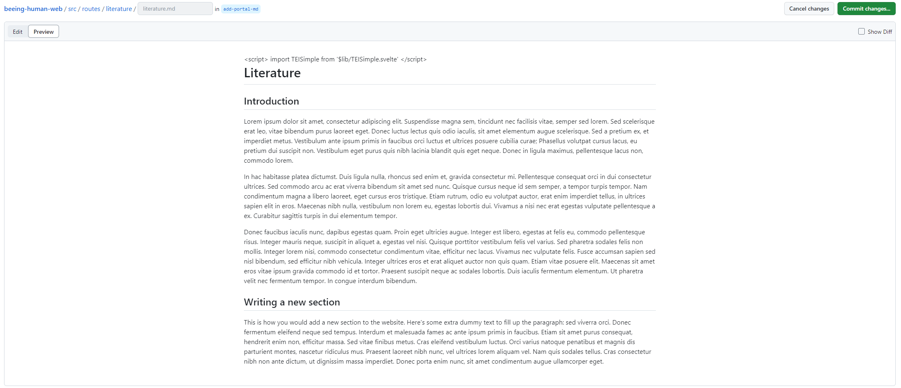
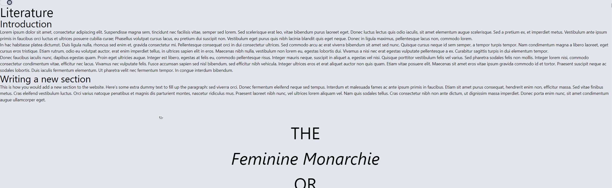

# How to: add a content section to the website

## Introduction

This short tutorial will guide you through the steps necessary to add new content to the _Bee book_. The steps to edit existing content are exactly the same, with the exception that instead of creating a new section file, you will edit an existing one.

## Requirements

- A GitHub account. If you need help setting one up, view [this guide](../register-github/README.md)
- Your account needs to be part of the project -- email Tiago to be added

## Instructions

- Login to [GitHub](https://github.com/)
- Navigate to the [_Bee Book_ repository](https://github.com/NewcastleRSE/beeing-human-web/)
- Create a [**new branch**](/documentation/create-new-branch/README.md)
- Navigate to `src`, then `routes` in the project files. You should see four folders: `literature`, `music`, `science`, `connections` (as well as some others that are not relevant). These folders correspond to each of the views on the website: adding content to one of these folders will create it in the corresponding view. Each of these folders will contain a file ending in `.md`: for example, the `literature` folder will contain a file named `literature.md`. This is the file you need to edit to change the content of the Literature view. To edit the file, click on the `Edit` button (the pencil icon on the top right of the file):

- Write the content in `Markdown` format: there are many handy guides online, [see this one for example](https://www.markdownguide.org/cheat-sheet/).

- You can use the `Preview` button to get a sense of what the finished text will look like.

- Once you are happy with your new file, or the changes to the existing file, click `Commit changes`

- Feel free to leave all options as default, or add a more extensive description if you wish. Click `Commit changes` on the pop-up window that appeared.

- [Create a new Pull Requst](/documentation/create-new-pull-request/README.md)

That's it! Tiago will receive a notification and test to make sure everything works before publishing the updated version.

The first time you try this method it might seem like a lot, but soon it will become second nature. Get in touch with Tiago if you have any questions.
