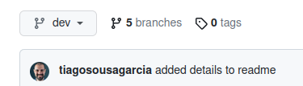
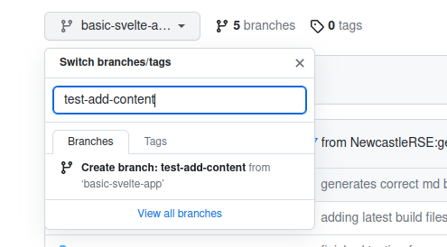

# How to: create a new branch to add content to the Bee Book

## Introduction
Before adding or changing any content to the _Bee Book_, you will need to create a new [branch](/documentation/10_GitHub_Concepts/10_github_concepts.md#branches) on GitHub for your changes. You need to do this before making any changes to the book, ensuring that any possible errors that can be introduced are isolated from the main book.

## Requirements
- A GitHub account. If you need help setting one up, view [this guide](/documentation/register-github/README.md)
- Your account needs to be part of the project -- email Tiago to be added

## Instructions
- Login to [GitHub](https://github.com/)
- Navigate to the [_Bee Book_ repository](https://github.com/NewcastleRSE/beeing-human-web/)
- Create a **new branch**:

  - On the top left of the screen, below the repository's header, you should see a button with a down arrow like this:

  

  - Click on the button and type a new name in the box:

  

  - Press the return key (Enter) or select 'Create branch'