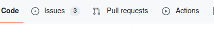
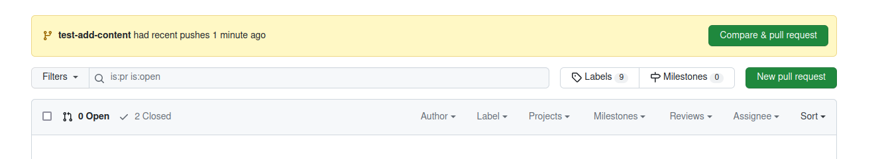
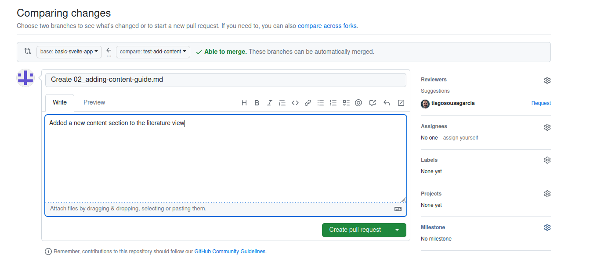
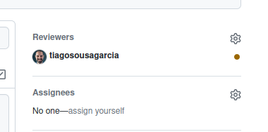

# How to: create a pull request to merge your changes

## Introduction
In order to merge the changes you made to the main _Bee Book_, you need to first [create a new branch](/documentation/create-new-branch/README.md) and then create a [pull request](/documentation/10_GitHub_Concepts/10_github_concepts.md#pull-request). A **pull request** is, basically, an action that tells the others that the changes you've made are ready to be incorporated into the main _Bee Book_. This then initiates a review process that will make sure no new errors are introduced into the publicly facing _Bee Book_.

## Requirements
- A GitHub account. If you need help setting one up, view [this guide](../register-github/README.md)
- Your account needs to be part of the project -- email Tiago to be added
- Your changes need to be part of a [new branch](/documentation/create-new-branch/README.md)

## Instructions
- Login to [GitHub](https://github.com/) and navigate to the [_Bee Book_ repository](https://github.com/NewcastleRSE/beeing-human-web/) if you are not already in it;

- Ensure you are in the correct branch: the dropdown box on the top left below the repository name should have the name you gave to your branch.

- Navigate to the `Pull Requests` tab on the repository header

- You should see a yellow banner with the name of the branch you created and a `Compare & pull request` button

- Click on the `Compare & pull request` button

- Feel free to leave the title of the pull request as default, replace the pre-populated body of the text with something descriptive like: 'added a new content section to...'

- On the right-hand side panel, you will see a section entitle `Reviewers` -- Tiago's name should appear as one of the suggestions. Click the `Request` link next to his name. The link should be replaced by a little yellow dot.

- Click `Create pull request`

Tiago will receive a notification that your changes are ready, and will make sure they are ready to be incorporated into the main _Bee Book_. Once he reviews the changes, he will merge them to the main `dev` branch, and republish the site. He will then let you know that your changes have been published.