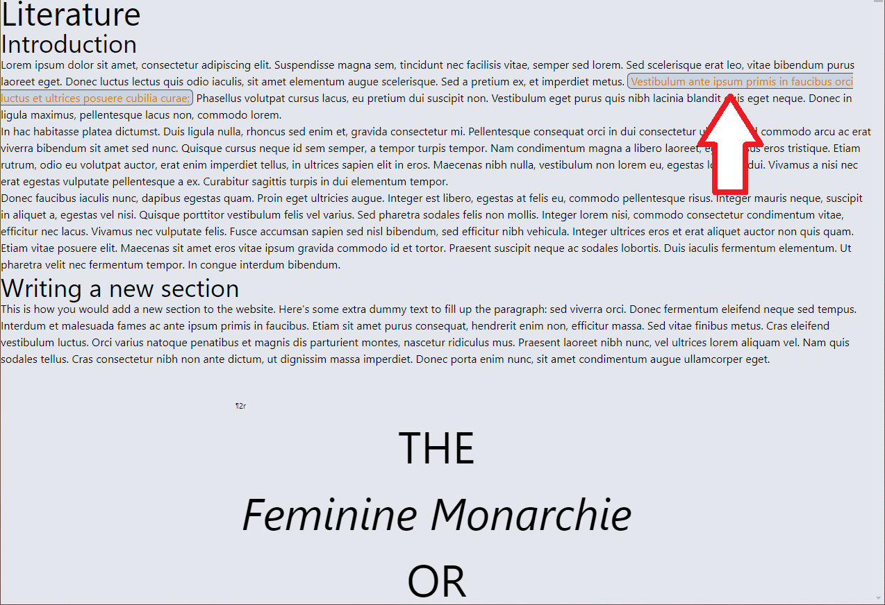
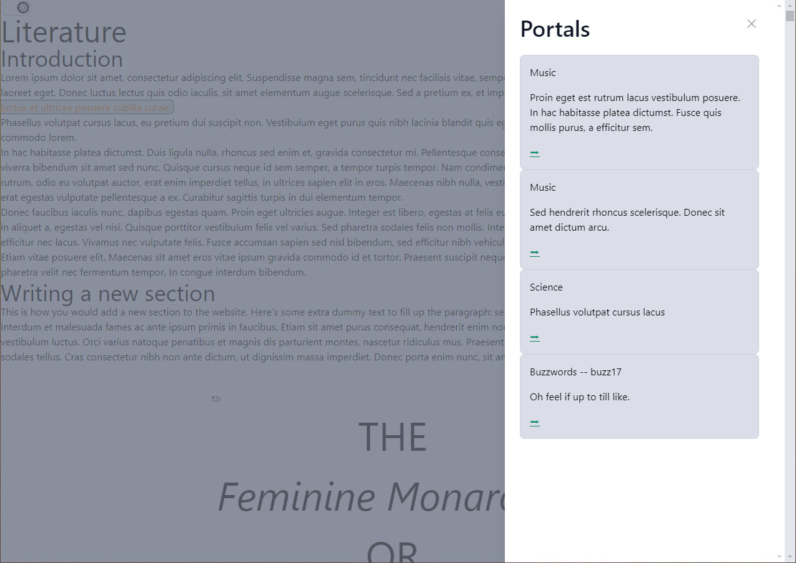

# Introduction

`Portals` are the special kind of links we use to connect one view of the bee book (say, `science`) to another view of the bee book (like `music`). They differ from normal links in the way in which they are styled to the user, and the way they behave on click: rather than taking the user to its linked place immediately, a portal will open a side panel that will give a list of the other portals that are linked to it and their content. This serves two functions: it gives the user an overview of the connections between different aspects of the bee book, and it might contain enough information without taking the user away from its current focus.




## Important concepts

-  There are three types of portals:
  1. **origin**: a portal that will lead somewhere else (i.e., the portal the user clicks);
  2. **destination**: a portal that is linked from somewhere else (i.e., from an origin portal);
  3. **both**: a portal that is both linked to, and linking from, other portals. Most portals should fall in this category.
- A portal can link to multiple other locations;
- A portal should link between different views of the text, though occasionally might make sense to connect to a different aspect of the same view (i.e, something in `music` linking somewhere else in `music`);
- If you are connecting to new places, you must *always* create two portals: one of `origin` or `both` type and one of `destination` or `both` type.
- When creating a new portal, make sure you give it a unique ID (i.e., one that no other portal has). Ids can be meaningful, but it is easier to keep them simple and sequencial: for example rather than giving it an id like `butler_science_music` use `sci1`
- IDs cannot contain any whitespace and, ideally, should be fairly short and sequential. If you *must* separate words within an id, use underscores (`_`) like the example above.

## Creating portals

Portals can be created in any of the markdown files that constitute the content of the bee book, i.e., any file that terminates with `*.md`, including the files for buzzwords. Portals are indicated by an HTML-like syntax: an opening tag, followed by the content, ended by a closing tag.

To create a portal:
1. Make sure that, near the top of the file you are editing, you see the following line:
```js
import Portal from '$lib/Portal.svelte'
```
2. You should see that in most of the existing files, but not if you are linking to or from a new buzzword. If that is the case, add the following to the top of the file you are editing:
```js
<script>
    import Portal from '$lib/Portal.svelte'
</script>
```
3. To create a Portal to link from, surround the text that you want to turn into a portal with the tags `<Portal></Portal>`, like in the following example:
```HTML
This is sample text that <Portal>contains a portal</Portal> within it.
```
4. Every portal you create needs two additional bits of information: a `type` which should be one of `origin`, `destination`, or `both`; and an `id` that should be unique to the portal you are creating. The id is what will allow you to connect one portal to another. Let's add those to our example:
```HTML
This is sample text that <Portal type="origin" id="test1">contains a portal</Portal> within it.
```
5. Portals of type `origin` or `both` must also contain another property, `destination`. But before that, we need to create the portal that we are linking to. So we'll open the `.md` we want to link to, (let's say `music`) and add a portal to the location we want:
```HTML
This sample text appears in music.md, and contains a <Portal type="destination" id="mus1">portion of text</Portal> that is linked to in our test.
```
6. Now that we have our destination, we can add it to our origin portal. The formatting for destinations is a little complex, but not impossible to understand. It should follow this structure: `destination={['VIEW#DESTINATION-PORTAL-ID1']}`, where the segments in capital letters are the ones that should change. `VIEW` refers to the section the destination appears in: so one of `literature`, `science`, `music`, `connections`, or `buzzwords`; `DESTINATION-PORTAL-ID1` is the id of the portal we want to link to. In the case of our test, it will be:
```HTML
This is sample text that <Portal type="origin" id="test1" destination={['music#mus1']}>contains a portal</Portal> within it.
```
7. If the portal contains more than one possible destinations, you add them inside of the `{[]}`, separating different destination portals with a `,`, in the following format: `destination={['VIEW#DESTINATION-PORTAL-ID1', 'VIEW#DESTINATION-PORTAL-ID2']}`. If our portal also linked to another portal in the `connections` view with an id of `con2`, we would have the following:
```HTML
This is sample text that <Portal type="origin" id="test1" destination={['music#mus1', 'connections#con2']}>contains a portal</Portal> within it.
```
8. That's it. When clicking on our test portal, we should see a preview of what appears inside the `mus1` portal (`portion of text`) with a link to it as well as whatever appears inside the `con2` portal.
